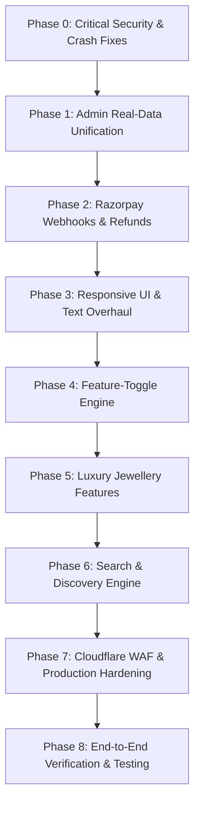

# Varnisha Jewels — Comprehensive Platform Audit, 17-Category Threat-Model & Phased Implementation Roadmap
**Document Path:** `planbyantigravity.md`  
**Target Repository:** `varnisha-e-commarce` (Backend, User Storefront, Admin Panel, Cloud Infrastructure)  
**Author:** Google Antigravity Advanced Agentic Engineering Team  
**Status:** Approved Architectural Blueprint — Awaiting User Execution Approval  

---

## Executive Summary & Skill Allocation Framework

### 1. `/skill-allocator` & Orchestration Pipeline
To deliver an enterprise-grade luxury e-commerce platform that resists all modern cyber threats, scales effortlessly across device form factors, and eliminates fake/mocked data, tasks are routed to specialized skills across our catalog:

| Workstream | Allocated Skill / Agent Role | Primary Objective |
| :--- | :--- | :--- |
| **Cybersecurity & Threat Defense** | `backend-security-coder`, `frontend-security-coder`, `security-scanning-security-hardening` | Audit and remediate all 17 cyberattack categories, ReDoS, OTP brute-force, mass assignment, and cryptographic verification. |
| **API & Backend Reliability** | `expressjs`, `nodejs`, `mongodb`, `api-design-principles` | Eliminate unhandled crashes, enforce atomic transactions (wallet/stock), implement Razorpay webhooks, and replace mock endpoints. |
| **Responsive UI/UX Architecture** | `tailwind-design-system`, `reactjs`, `nextjs-app-router-patterns` | Redesign Header, Footer, Admin drawer, fluid tables, and touch interactions across 320px–1920px+ viewports. |
| **Enterprise Features & Data Flow** | `full-stack-orchestration-full-stack-feature`, `sql-pro` | Implement GST tax invoices, live gold rate ticker, public feature toggles, and real customer refund workflows. |
| **Cloud Infrastructure & DevOps** | `multi-cloud-architecture`, `deployment-pipeline-design` | Cloudflare WAF, IMDSv2 enforcement, S3 backup automation, and Nginx SSL zero-downtime stability. |

---

## 2. End-to-End Real Data vs. Fake/Mock Audit

A critical finding from this comprehensive codebase audit is that several core modules return `HTTP 200` with hardcoded static constants or discard data on submit, creating an illusion of functionality without persistent database backing.

### 2.1 Admin Panel (`varnisha-e-commarce-admin`)

| Admin Module | Current Implementation Status | Real DB Persistence vs. Mock | Exact File Reference | Required Fix |
| :--- | :--- | :--- | :--- | :--- |
| **Orders** | **100% Mocked** | ❌ Displays hardcoded `ordersData` array. Never queries backend API. Status updates do not persist. | `app/(admin)/orders/page.js:25-90` | Wire to `GET /api/v1/admin/orders` and `PUT /api/v1/admin/orders/:id` with real tracking numbers and status change modals. |
| **Categories** | **Mocked Save** | ❌ Displays `CATEGORIES` array. Modal "Save" button has comment `// dispatch to Redux / call API` and does nothing. | `app/(admin)/categories/page.js:230-245` | Connect modal submit to `POST /api/v1/products/categories` and `PUT /api/v1/products/categories/:id`. |
| **Collections** | **100% Mocked** | ❌ Hardcoded `COLLECTIONS` array. No API integration. | `app/(admin)/collections/page.js:15-80` | Connect to backend `ProductCollection` model via `api.get("/products/collections")`. |
| **Roles & Permissions** | **100% Mocked** | ❌ Hardcoded `ROLES` and `PERMISSIONS` constants. Creating or modifying roles does not save to MongoDB. | `app/(admin)/roles/page.js:18-110` | Connect to `GET /api/v1/admin/roles` and `POST /api/v1/admin/roles`. |
| **Store Settings (Root)** | **100% Mocked** | ❌ Fields in `CONTENT` object are static strings. Save button does not call `/api/v1/settings`. (Only `/settings/loyalty` works). | `app/(admin)/settings/page.js:27-120` | Fetch from `GET /api/v1/settings` on mount and save via `PUT /api/v1/settings`. |
| **Reviews Moderation** | **100% Mocked** | ❌ Displays static mock reviews. Does not connect to backend review moderation endpoints. | `app/(admin)/reviews/page.js:15-85` | Connect to `GET /api/v1/admin/reviews` and `PUT /api/v1/admin/reviews/:id/status`. |
| **CMS Pages & Looks** | **100% Mocked** | ❌ Static data in `app/(admin)/content/page.js`. Does not fetch or persist to `/api/v1/cms`. | `app/(admin)/content/page.js:20-95` | Connect to `GET/POST /api/v1/cms/pages`, `/cms/blogs`, and `/cms/looks`. |
| **Analytics** | **100% Mocked** | ❌ `MONTHLY_REVENUE`, `TOP_CITIES`, `PAYMENT_METHODS` are static constants. | `app/(admin)/analytics/page.js:10-60` | Create backend aggregation pipelines in `financeController.js` and render real dynamic charts. |
| **Notifications Settings** | **100% Mocked** | ❌ Static switches without API binding. | `app/(admin)/notifications/page.js` | Wire to `GET/PUT /api/v1/settings/notifications`. |
| **Products & Catalog** | **Real DB Integration** | ✅ Fully functional: loads, edits, creates, uploads images to S3, and deletes real products. | `app/(admin)/products/page.js` | Maintain and enhance variant management. |
| **Inventory & Procurement** | **Real DB Integration** | ✅ Functional: PO creation, supplier management, inventory sync with MongoDB. | `app/(admin)/inventory/suppliers/page.js` | Maintain and add low-stock threshold alerts. |
| **Customer Directory** | **Real DB Integration** | ✅ Functional: searches and modifies user block/active status via `/api/v1/admin/users`. | `app/(admin)/customers/page.js` | Maintain and add order history drilldown. |
| **Finance & Ledger** | **Real DB Integration** | ✅ Functional: queries expenses, profit/loss, and investments via `/api/v1/finance`. | `app/(admin)/finance/page.js` | Maintain and link to live order revenue. |
| **Support Tickets** | **Real DB Integration** | ✅ Functional: lists and replies to support tickets via `/api/v1/support`. | `app/(admin)/support/page.js` | Maintain and add ticket status transitions. |
| **Audit Log Trail** | **Real DB Integration** | ✅ Functional: queries `/api/v1/admin/logs` with geolocation tracking. | `app/(admin)/audit/page.js` | Maintain and add export-to-CSV capability. |

---

### 2.2 User Storefront (`varnisha-e-commarce-user`)

| Storefront Feature | Current Implementation Status | Real DB Persistence vs. Mock | Exact File Reference | Required Fix |
| :--- | :--- | :--- | :--- | :--- |
| **Shopping Cart** | **Client-Side Only** | ⚠️ Persists in browser `localStorage` via `CartContext`. Not synced to backend database for logged-in users across devices. | `context/CartContext.jsx:1-85` | Add optional DB sync for authenticated users (`POST /api/v1/cart/sync`). |
| **Wishlist** | **Ephemeral Local State** | ❌ `setWished(!wished)` only toggles local React state on product card. Lost on navigation. | `components/ui/ProductCard.jsx:9, 74` | Build real `Wishlist` MongoDB schema, `/api/v1/wishlist` endpoints, and link to account page. |
| **Customer Checkout** | **Real DB Integration** | ✅ Functional: creates real DB orders, checks stock, supports wallet deduction, and verifies Razorpay signatures. | `app/checkout/page.js:149-175` | Add Razorpay webhook listener on backend to prevent orphaned payments if browser disconnects. |
| **Account & Orders** | **Real DB Integration** | ✅ Functional: queries `/api/v1/orders/my-orders`, `/auth/profile`, and `/auth/logs`. | `app/account/page.js`, `app/account/orders/[id]/page.js` | Add real invoice download and order cancellation request button. |
| **Order Confirmation** | **Real DB Integration** | ✅ Functional: fetches order by `orderId` parameter from backend. | `app/order-confirmed/page.js:52-75` | Add printable GST invoice button and delivery timeline tracker. |
| **Invoices** | **HTML Receipt Only** | ❌ Displays plain HTML screen receipt. No formal GST Tax Invoice with HSN code, GSTIN, and BIS Hallmark certificate. | `app/order-confirmed/page.js` | Integrate `pdfkit` / Puppeteer server-side invoice generation with download button. |
| **Feature Toggles** | **Missing** | ❌ No feature flag client or backend public endpoint. Features cannot be toggled remotely by admin. | N/A | Implement `/api/v1/settings/features` and `FeatureToggleContext` in storefront. |

---

## 3. Comprehensive 17-Category Threat-Model & Attack Defense Matrix

This threat model comprehensively audits all 17 cyberattack categories and their sub-types specified by the user, providing current status, concrete vulnerabilities discovered in the codebase, and exact hardening solutions.

### Category 1: Website / Web Application Attacks

| Attack Subtype | Current Codebase Status | Findings & Vulnerabilities | Mandatory Defense Implementation |
| :--- | :---: | :--- | :--- |
| **SQL Injection (SQLi, Blind, Time-Based)** | **Immune** | MongoDB is used instead of SQL. No raw SQL drivers or query builders present. | Continue schema parameterization. |
| **NoSQL Injection** | **Protected with Gaps** | `mongoSanitize()` in `server.js:112` removes `$` and `.` from `req.body` and `req.query`. However, raw regex queries accept unescaped strings. | Enforce strict Yup schema casting and escape regex characters everywhere. |
| **Command / OS / Code Injection** | **Protected** | No `child_process.exec`, `eval()`, or `vm.runInContext()` executed with user-supplied input. | Keep `exec` out of request lifecycles. |
| **LDAP / XPath Injection** | **N/A** | No LDAP directory or XML/XPath database used. | N/A. |
| **Cross-Site Scripting (XSS)**<br>*(Reflected, Stored, DOM)* | **Partially Protected** | React/Next.js automatically escapes JSX bindings. However, `views/emails/*.ejs` uses `<%- bodyHtml %>` which renders raw unescaped HTML. | Sanitize all rich text via `sanitize-html` or `DOMPurify` before passing to email templates. Set strict `Content-Security-Policy`. |
| **Cross-Site Request Forgery (CSRF)** | **Protected** | Auth tokens use `Authorization: Bearer` headers. Cookies configured with `sameSite: "lax"` and `httpOnly: true`. | Ensure state-changing POST/PUT/DELETE routes require authentication and valid origin checks. |
| **Server-Side Request Forgery (SSRF)** | **Protected** | S3 uploads are strictly controlled via AWS SDK. No user-supplied URL fetching (`axios.get(req.body.url)`) exists on the backend. | Disallow user-specified remote fetch destinations. |
| **Server-Side Template Injection (SSTI)** | **Protected** | EJS templates are precompiled statically in `views/emails/`. No user input is passed as raw EJS code. | Keep template strings immutable. |
| **XML External Entity (XXE)** | **Immune** | Express only parses JSON and URL-encoded forms (`express.json()`, `express.urlencoded()`). No XML body parser enabled. | Keep XML body parsers disabled. |
| **HTTP Request Smuggling & Splitting** | **Protected at Proxy** | Handled by Nginx reverse proxy using HTTP/1.1 upstream keepalive and HTTP/2 on client edge. | Ensure Nginx `proxy_http_version 1.1` and `proxy_set_header Connection ""` remain active. |
| **Host Header & CRLF Injection** | **Protected** | CORS explicitly validates against `allowedOrigins` allowlist (`server.js:68-91`). Helmet removes newline injection vectors in headers. | Retain strict origin checking. |
| **Open Redirect** | **Protected** | Redirect URLs in user login (`/login?redirect=/checkout`) only accept relative paths starting with `/`. | Enforce `redirect.startsWith("/") && !redirect.startsWith("//")` check. |
| **Clickjacking (UI Redressing)** | **Protected** | `securityHeaders.js:17` sets `frameguard: { action: "deny" }` and `X-Frame-Options: DENY`. | Retain `DENY` header across all responses. |
| **CORS Misconfiguration** | **Protected** | `server.js:80-91` verifies `allowedOrigins` explicitly. Wildcards and stale domains were permanently removed. | Maintain strict origin array. |
| **LFI / RFI & Path Traversal** | **Protected** | S3 upload keys are generated via `Date.now() - crypto.randomUUID()`. Static `/uploads` and `/public` directories are strictly sandboxed. | Retain path hashing and basename filtering. |
| **File Upload Vulnerabilities** | **Partially Protected** | `uploadMiddleware.js` verifies extension regex and MIME type, enforcing a 5MB size limit. However, image magic bytes are not checked. | Add `sharp` buffer inspection to verify true JPEG/PNG/WebP magic numbers before S3 dispatch. |
| **Insecure Deserialization** | **Protected** | Native JSON parsing used exclusively. No `node-serialize` or Python `pickle`. | Retain standard JSON serialization. |
| **Prototype Pollution** | **Protected** | `hpp()` and `mongoSanitize()` enabled. Object merges use standard shallow copies (`{ ...acc }`). | Continue avoiding unsafe recursive object assignments. |
| **Race Conditions (TOCTOU)** | **High Vulnerability in Orders** | While wallet debit has an atomic guard, stock deduction at checkout (`orderController.js:163-181`) occurs sequentially across an array without a multi-document transaction session. | Wrap checkout and inventory decrement in a MongoDB multi-document transaction (`session.withTransaction()`). |
| **Business Logic Abuse** | **Partially Protected** | Self-referral abuse is blocked. However, coupon usage limits per customer are not tracked across multiple checkouts. | Record redeemed coupons per user ID in MongoDB. |
| **BOLA / IDOR** | **Protected** | `getOrderById` verifies `order.customer.toString() === req.user.id`. Support ticket and wallet endpoints scope queries to `req.user._id`. | Continue scoping queries to `req.user._id`. |
| **Mass Assignment** | **Protected** | Allowlist filtering (`pickSettableFields`, `pick(req.body, SUPPLIER_FIELDS)`) implemented in settings, procurement, and products. | Audit any newly added controllers for allowlist validation. |

---

### Category 2: DDoS / Availability Attacks

| Attack Subtype | Current Codebase Status | Findings & Vulnerabilities | Mandatory Defense Implementation |
| :--- | :---: | :--- | :--- |
| **HTTP/HTTPS Flood & App DDoS** | **Partial** | App-level `apiLimiter` backed by MongoDB exists. However, high-volume floods will overwhelm Node.js and MongoDB connection pools. | Put Cloudflare CDN/WAF in front of `varnisha.com`, `laxmi.varnisha.com`, and `api.varnisha.com` with DDoS mitigation enabled. |
| **SYN / UDP / ICMP Flood** | **Infrastructure Scope** | Single EC2 `t3.medium` instance. AWS Shield Standard provides basic L3/L4 protection. | Rely on AWS infrastructure and Cloudflare proxy mode. |
| **Slowloris & Slow POST** | **Partially Protected** | Nginx has default timeout settings. Node `server.js` parses requests with a 10MB limit. | Configure Nginx `client_body_timeout 10s; client_header_timeout 10s; keepalive_timeout 30s;`. |
| **Regular Expression Denial of Service (ReDoS)** | **CRITICAL VULNERABILITY FOUND** | `productController.js:52`, `financeController.js:418`, and `adminController.js:451` pass unescaped `req.query.search` directly into `{ $regex: search, $options: "i" }`. An attacker can submit catastrophic backtracking patterns (e.g. `(a+)+$`) to peg CPU at 100%. | Add an `escapeRegex()` helper and sanitize all query parameters before passing them to `$regex`. |
| **Resource Exhaustion (Uncaught Crashes)** | **CRITICAL VULNERABILITY FOUND** | `server.js:98-109` parses cookies via `decodeURIComponent((parts[1] || "").trim())` without `try/catch`. Sending malformed percent-encoding (`%E0%A4%A`) throws `URIError`, causing server crash loops. | Wrap cookie parsing in `try/catch` and gracefully ignore malformed cookies. |

---

### Category 3: Server Attacks

| Attack Subtype | Current Codebase Status | Findings & Vulnerabilities | Mandatory Defense Implementation |
| :--- | :---: | :--- | :--- |
| **Remote Code Execution (RCE)** | **Protected** | No shell execution or arbitrary file inclusions present in application code. | Retain strict code isolation. |
| **Privilege Escalation** | **Protected** | Admin and User models are strictly separated. `protect` and `requireAdmin` verify `req.userType === "Admin"` from database records. | Never allow user type modification through self-service profile update. |
| **Web Shells / Malicious Files** | **Protected** | Files are stored directly in AWS S3 with generated random keys, completely separated from server executable paths. | Keep uploads out of the local OS filesystem. |
| **SSH Brute Force** | **Protected** | EC2 security group restricts SSH access to key-pair authentication. | Disable password-based SSH on EC2; use fail2ban if open to public IP. |
| **Container Escape / Memory Corruption** | **N/A** | Running on Node.js v20 via PM2 on Ubuntu 22.04 LTS. | Keep Node.js and Ubuntu packages updated with unattended security patches. |

---

### Category 4: Domain / DNS Attacks

| Attack Subtype | Current Codebase Status | Findings & Vulnerabilities | Mandatory Defense Implementation |
| :--- | :---: | :--- | :--- |
| **DNS Spoofing / Hijacking** | **Registrar Dependent** | Nameservers hosted on AWS Route 53. Multi-factor authentication required on AWS account. | Enable Route 53 DNSSEC signing and registrar lock. |
| **Subdomain Takeover** | **Protected** | All subdomains (`varnisha.com`, `laxmi.varnisha.com`, `api.varnisha.com`) point directly to the active Elastic IP `13.234.5.160`. | Audit Route 53 for any dangling CNAME records pointing to decommissioned services. |

---

### Category 5: SSL / TLS Attacks

| Attack Subtype | Current Codebase Status | Findings & Vulnerabilities | Mandatory Defense Implementation |
| :--- | :---: | :--- | :--- |
| **SSL Stripping & Protocol Downgrade** | **Protected** | Nginx enforces HTTP-to-HTTPS redirect (`return 301 https://$host$request_uri;`). HSTS header is enabled with `preload` and 1-year max-age. | Keep HSTS active in Nginx and Helmet. |
| **Weak Ciphers & Expired Certificates** | **Protected** | Let's Encrypt certificates managed by Certbot with automatic daily renewal systemd timer. Modern TLS 1.2/1.3 ciphers enforced. | Monitor Certbot renewal status via cron health checks. |
| **Man-in-the-Middle (MITM)** | **Protected** | All client-to-server and admin-to-server traffic is TLS encrypted. | Ensure Cloudflare SSL mode is set to "Full (Strict)". |

---

### Category 6: Email / Domain-Based Attacks

| Attack Subtype | Current Codebase Status | Findings & Vulnerabilities | Mandatory Defense Implementation |
| :--- | :---: | :--- | :--- |
| **Email Spoofing & Phishing** | **Configuration Dependent** | System sends transactional emails from `noreply@varnisha.com` via Nodemailer. | Configure Route 53 TXT records with strict SPF (`v=spf1 include:... ~all`), DKIM 2048-bit keys, and DMARC policy (`p=reject;`). |
| **Business Email Compromise (BEC)** | **Procedural Scope** | Admin emails require secure credentials. | Enforce MFA on all corporate email accounts. |

---

### Category 7: API Attacks

| Attack Subtype | Current Codebase Status | Findings & Vulnerabilities | Mandatory Defense Implementation |
| :--- | :---: | :--- | :--- |
| **API Key Theft / Leakage** | **Protected** | Razorpay secret and JWT secrets are stored exclusively in backend `.env`. Next.js frontend only receives public key (`NEXT_PUBLIC_RAZORPAY_KEY_ID`). | Keep secrets out of client-side bundles and Git history. |
| **JWT Attacks (Algorithm Confusion)** | **Protected** | `authMiddleware.js:32` pins verification algorithm to `{ algorithms: ["HS256"] }`, blocking `none` algorithm exploit. | Keep algorithm pinning enforced. |
| **Rate-Limit Bypass** | **Protected** | Atomic MongoDB aggregation updates in `RateLimit.findOneAndUpdate` prevent concurrent hits from bypassing limits. | Add IP reputation filtering via Cloudflare. |
| **Excessive Data Exposure** | **Protected** | `getProfile` and `getMe` explicitly whitelist safe fields, excluding internal flags (`isBlocked`, `failedLoginAttempts`, `password`). | Audit newly created API responses for schema leakage. |

---

### Category 8: Database Attacks

| Attack Subtype | Current Codebase Status | Findings & Vulnerabilities | Mandatory Defense Implementation |
| :--- | :---: | :--- | :--- |
| **Database Credential Theft** | **Remediated** | MongoDB password containing special character `@` was URL-encoded. Stored only in backend `.env`. | Rotate MongoDB credentials in production and restrict database user permissions. |
| **Unprotected Database Port** | **Protected** | MongoDB listens on `127.0.0.1:27017`. AWS Security Group blocks port 27017 from internet ingress. | Verify MongoDB `bindIp: 127.0.0.1` in `/etc/mongod.conf`. |
| **Insecure / Unencrypted Backups** | **Partially Configured** | `cronJobs.js` defines an automated S3 dump routine, but requires `BACKUPS_BUCKET_NAME` to be configured on the server. | Ensure `BACKUPS_BUCKET_NAME` is set in production with AES-256 S3 bucket encryption enabled. |

---

### Category 9: Authentication / Account Attacks

| Attack Subtype | Current Codebase Status | Findings & Vulnerabilities | Mandatory Defense Implementation |
| :--- | :---: | :--- | :--- |
| **OTP Brute-Forcing** | **CRITICAL VULNERABILITY FOUND** | `verifyEmailOTP` (`authController.js:329`) and `loginWithOTP` (`authController.js:634`) do NOT increment failed attempt counters. A 6-digit OTP (1M combinations) can be brute-forced within its 15-minute validity window. | Add `failedOTPAttempts` counter: invalidate OTP after 5 consecutive failures and lock verification for 15 minutes. Use `crypto.timingSafeEqual` for OTP comparison. |
| **Account Lockout / Brute Force** | **Protected** | Standard password logins lock accounts for 15 minutes (users) and 30 minutes (admins) after 5 failed attempts. | Retain account lockout logic. |
| **Account Enumeration** | **Partially Vulnerable** | `resendVerificationOTP` returns `404: User not found`, allowing attackers to harvest registered emails. | Return a generic message: *"If an account exists, a code has been sent"* to prevent email enumeration. |
| **Session Hijacking & Cookie Theft** | **Protected** | Tokens are stored in `httpOnly`, `secure: true`, `sameSite: "lax"` cookies, inaccessible to client-side JavaScript. | Retain `httpOnly` cookie delivery. |
| **Admin MFA / 2FA** | **GAP IDENTIFIED** | Admin panel relies solely on password authentication. | Implement TOTP 2-Factor Authentication (Authenticator app) for Super Admin and Finance roles. |

---

### Category 10: Malware Attacks

| Attack Subtype | Current Codebase Status | Findings & Vulnerabilities | Mandatory Defense Implementation |
| :--- | :---: | :--- | :--- |
| **Web Shells & Trojans** | **Protected** | Static user uploads are dispatched directly to AWS S3. Local filesystem execution is completely disabled. | Ensure S3 bucket policy blocks public execution (`Content-Disposition: inline` for images only). |
| **Server Rootkits & Botnets** | **Infrastructure Scope** | Server runs standard LTS packages. PM2 manages Node.js processes. | Run ClamAV or AWS Inspector vulnerability scanning on EC2. |

---

### Category 11: Supply-Chain Attacks

| Attack Subtype | Current Codebase Status | Findings & Vulnerabilities | Mandatory Defense Implementation |
| :--- | :---: | :--- | :--- |
| **Malicious npm Dependencies** | **Partially Protected** | `package-lock.json` pins exact hashes. | Run `npm audit` and integrate GitHub Dependabot to catch vulnerable dependencies in CI. |
| **Compromised CI/CD Actions** | **Protected** | Deployment scripts run via explicit SSH commands. | Pin GitHub Action versions to exact commit SHA rather than floating `@v3` tags. |

---

### Category 12: Cloud / Hosting Attacks

| Attack Subtype | Current Codebase Status | Findings & Vulnerabilities | Mandatory Defense Implementation |
| :--- | :---: | :--- | :--- |
| **AWS IMDSv1 SSRF Theft** | **Partially Protected** | Terraform sets `http_tokens = "required"` (IMDSv2). Must ensure this is applied on live AWS instance. | Run `aws ec2 modify-instance-metadata-options --instance-id i-... --http-tokens required --http-endpoint enabled` on the EC2 instance. |
| **Leaked AWS Keys** | **Protected** | Codebase uses EC2 Instance IAM Profile (`s3Service.js`). No hardcoded AWS access keys exist in code. | Retain IAM Role usage for all AWS SDK calls. |
| **Public S3 Data Exposure** | **Protected** | Image bucket permissions only allow public read on the `/uploads` prefix. Root bucket listing is blocked. | Maintain private bucket defaults with restrictive bucket policies. |

---

### Category 13: WordPress / CMS Attacks

| Attack Subtype | Current Codebase Status | Findings & Vulnerabilities | Mandatory Defense Implementation |
| :--- | :---: | :--- | :--- |
| **WordPress Core/Plugin Vulnerabilities** | **N/A (Immune)** | Platform is a custom full-stack JavaScript application (Next.js 16 + Express.js 4 + MongoDB). No WordPress, PHP, or Apache components exist. | Retain custom decoupled architecture. |

---

### Category 14: Client-Side / Browser Attacks

| Attack Subtype | Current Codebase Status | Findings & Vulnerabilities | Mandatory Defense Implementation |
| :--- | :---: | :--- | :--- |
| **Magecart / Digital Skimming** | **Protected** | Card and UPI details are handled directly inside Razorpay's PCI-DSS compliant iframe modal (`checkout.razorpay.com`). Card data never touches Varnisha servers. | Keep payment card collection inside official Razorpay SDK iframe. |
| **DOM-Based XSS & Storage Theft** | **Protected** | Sensitive tokens are stored in `httpOnly` cookies rather than `localStorage`. React JSX prevents unsafe HTML injection. | Avoid `dangerouslySetInnerHTML` throughout Next.js components. |

---

### Category 15: Information / Data Attacks

| Attack Subtype | Current Codebase Status | Findings & Vulnerabilities | Mandatory Defense Implementation |
| :--- | :---: | :--- | :--- |
| **Sensitive Data Exposure (.env Leaks)** | **Protected** | `.gitignore` excludes all `.env*` files. Nginx configuration blocks direct requests to hidden dotfiles (`location ~ /\. { deny all; }`). | Retain Nginx dotfile denial rule. |
| **Stack Trace Leakage** | **Protected** | `errorHandler.js` suppresses error stack traces when `NODE_ENV === "production"`, returning only high-level error messages. | Ensure `NODE_ENV=production` is permanently active in PM2 ecosystem. |
| **Software Version Disclosure** | **Protected** | Helmet removes `X-Powered-By` header. Nginx configured with `server_tokens off;`. | Retain `server_tokens off` in Nginx config. |

---

### Category 16: Infrastructure / Network Attacks

| Attack Subtype | Current Codebase Status | Findings & Vulnerabilities | Mandatory Defense Implementation |
| :--- | :---: | :--- | :--- |
| **Port Scanning / Reconnaissance** | **Protected** | AWS Security Group allows inbound traffic ONLY on Port 80 (HTTP) and Port 443 (HTTPS). Ports 3045, 3000, 3001, and 27017 are blocked from external ingress. | Never open backend or database ports to `0.0.0.0/0`. |
| **ARP / IP Spoofing** | **Infrastructure Scope** | AWS VPC software-defined network automatically drops spoofed ARP/IP frames. | AWS VPC default protections active. |

---

### Category 17: Website Defacement / Destruction

| Attack Subtype | Current Codebase Status | Findings & Vulnerabilities | Mandatory Defense Implementation |
| :--- | :---: | :--- | :--- |
| **Database Deletion / Drop Attack** | **Protected** | MongoDB authentication enabled with strong credentials. Database port is not exposed. Soft deletion (`isDeleted: true`) enforced across Mongoose schemas. | Enforce IAM least-privilege policies and automated daily encrypted S3 backups. |
| **Homepage Defacement / Admin Takeover** | **Protected with Gaps** | Admin controllers require role-based permissions (`checkPermission`). However, lack of MFA exposes admin credentials to phishing. | Implement Admin TOTP MFA and immutable audit logging for all admin configuration changes. |

---

## 4. Full PC and Mobile Responsive Design System Overhaul

A key problem reported by the user is layout breakage, squished columns, and truncated text across PC laptops, tablets, and mobile devices:
> *"my website is not proper all pc screen size responsive and all mobile device screen size responsive so want to make a proper responsive , some taxtext is cut in layout like footer header and components as well so check properly for that"*

### 4.1 Root Causes Identified

1. **Header Component (`components/layout/Header.jsx`)**:
   - On compact PC laptops (1024px–1280px wide), `.container-luxury` applies `padding: 0 64px;` (128px total). Combined with the brand logo, 5 navigation links with luxury letter-spacing, search button, wishlist counter, and customer atelier dropdown, the header container overflows its flex boundaries, causing text wrapping or clipping.
   - On tablets (768px–1023px), desktop links are hidden with `hidden lg:flex`, but the search, wishlist, and profile buttons are also hidden, leaving only the hamburger menu and the shopping bag icon.
   - In the mobile menu drawer (`mobileOpen`), navigation lacks expandable accordion sub-menus, cutting off deep links.

2. **Footer Component (`components/layout/Footer.jsx`)**:
   - Line 38 sets `grid grid-cols-1 lg:grid-cols-6 gap-10 lg:gap-12`. There are no intermediate breakpoints (`sm:grid-cols-2` or `md:grid-cols-3`).
   - On tablets (768px–1023px), all 6 footer columns stack vertically into a single tall column, forcing users to scroll through endless lists.
   - At 1024px, 6 columns are forced into ~135px width each. Long luxury jewelry links (e.g. *"Jewellery Care Guide"*, *"Book an Appointment"*, *"Compare Products"*) suffer word-wrapping and visual truncation.
   - In the bottom copyright bar, text is left-aligned on mobile instead of centered, overflowing mobile viewports.

3. **Product Card Component (`components/ui/ProductCard.jsx`)**:
   - Quick Add overlay relies entirely on mouse hover (`onMouseEnter`/`onMouseLeave`). On mobile and tablet touchscreens, hovering does not exist, making Quick Add completely unreachable.
   - Price displays (`₹1,45,000` + strikethrough original price) overflow and wrap onto multiple lines in 2-column mobile grids (320px–375px viewports).

4. **Admin Panel Layout (`varnisha-e-commarce-admin`)**:
   - `.admin-sidebar` is permanently fixed at `width: 256px;`.
   - `.admin-main` has a hardcoded `margin-left: 256px;` with zero responsive media queries.
   - On screens below 1024px, the sidebar consumes a massive portion of the screen or completely blocks mobile views.
   - Data tables (Orders, Customers, Inventory, Finance) lack horizontal scroll wrappers (`overflow-x-auto min-w-[750px]`), causing action buttons and status badges to get crushed or cut off.

---

### 4.2 Standardized Responsive Breakpoint Hierarchy

All components and global styling will be refactored to strictly adhere to standard responsive breakpoints:

```
┌─────────────────┬─────────────────┬──────────────────────────────────────────────────┐
│ Device Class    │ Breakpoint      │ Responsive Layout Strategy                       │
├─────────────────┼─────────────────┼──────────────────────────────────────────────────┤
│ Mobile Small    │ 320px – 374px   │ 1-column grid, compact badges, fluid font-size    │
│ Mobile Standard │ 375px – 424px   │ 2-column compact grid, touch targets ≥ 44x44px   │
│ Mobile Large    │ 425px – 767px   │ 2-column standard grid, slide-out drawers        │
│ Tablet          │ 768px – 1023px  │ 3-column grid, 2-column footer, tablet header bar│
│ Laptop Compact  │ 1024px – 1279px │ 4-column grid, condensed nav gaps (gap-3), pad-6 │
│ Desktop Standard│ 1280px – 1535px │ Full luxury layout, mega menu, 6-column footer   │
│ Ultrawide       │ 1536px+         │ max-w-7xl centered container, relaxed paddings   │
└─────────────────┴─────────────────┴──────────────────────────────────────────────────┘
```

---

### 4.3 Detailed Layout Fixes

#### A. Header (`components/layout/Header.jsx`)
- Replace fixed `gap-6 xl:gap-8` with fluid `gap-2 xl:gap-6` and reduce nav link font size slightly on 1024px–1200px viewports to eliminate clipping.
- Add tablet-optimized header bar (768px–1023px) that keeps search and account icons visible next to the hamburger menu.
- Convert mobile navigation drawer into a collapsible accordion for sub-collections.
- Enforce `white-space: nowrap` and `text-overflow: ellipsis` on dynamic customer atelier greetings.

#### B. Footer (`components/layout/Footer.jsx`)
- Change footer grid to: `grid grid-cols-1 sm:grid-cols-2 md:grid-cols-3 lg:grid-cols-6 gap-8 lg:gap-10`.
- On mobile and tablets, group related link lists into clean multi-column layouts so footer height remains balanced.
- In the newsletter section, allow input and button to wrap gracefully on ultra-small screens (320px).
- In the bottom copyright bar, enforce `text-center md:text-left` and stack legal links neatly on mobile.

#### C. Product Card (`components/ui/ProductCard.jsx`)
- Add an explicit, touch-friendly "Quick Add" floating action button visible on touchscreens (`lg:hidden inline-flex`) so mobile users can add items to their bag with a single tap.
- Format prices in a flex-wrap container with `text-xs sm:text-sm font-semibold` to prevent price text truncation on narrow 320px devices.
- Apply `line-clamp-2` with minimum height reservation on product titles so cards maintain uniform alignment across all grid columns.

#### D. Admin Panel Responsive Overhaul
- **Mobile Slide-Out Drawer**: Refactor `AdminSidebar.jsx` with an off-canvas drawer controlled by a top header hamburger button on screens `< 1024px`.
- **Responsive Layout Classes**: Change `.admin-main` from static `margin-left: 256px;` to `lg:ml-64 ml-0 transition-all duration-300`.
- **Fluid Data Table Containers**: Wrap all table structures in `<div className="w-full overflow-x-auto shadow-sm rounded border border-gray-200"><table className="min-w-[750px] w-full ...">...</table></div>`.
- **Responsive Form Grids**: Refactor product and order editing modals from fixed widths (`w-[650px]`) to `w-full max-w-2xl max-h-[90vh] overflow-y-auto m-4`.

---

## 5. High-Value Modern Feature Additions for Luxury Jewellery E-Commerce

To elevate Varnisha Jewels to the standards of luxury jewellery leaders (such as Cartier, Tiffany & Co., and Tanishq), the following high-value features are designed for phased rollout:

### 1. GST-Compliant Tax Invoice PDF Engine
- **Business Need**: Jewellery sales in India require strict GST compliance (3% GST on gold and diamond jewellery, HSN Code 7113, GSTIN, and BIS Hallmark certification numbers).
- **Architecture**: Server-side PDF generation using `pdfkit` or dynamic HTML-to-PDF pipeline in Express backend (`GET /api/v1/orders/:id/invoice`).
- **Storefront & Admin Integration**:
  - Customer order confirmation and order history page feature a 1-click `"Download Official Tax Invoice (PDF)"` button.
  - Admin Orders page features batch invoice generation for dispatch parcels.

### 2. Public Feature-Toggle Engine
- **Business Need**: The administrator must be able to enable or disable features (e.g. AI Studio, Gift Registry, Loyalty Rewards, COD Checkout, Live Chat) from the Admin panel, with instant changes reflected on the storefront without code redeployment.
- **Architecture**:
  - Add `featureFlags` map to `StoreSetting` MongoDB schema.
  - Create public endpoint: `GET /api/v1/settings/public-features` (cached with 60s TTL).
  - Create `FeatureToggleContext` in Next.js storefront to conditionally render navigation links, buttons, and checkout options.

### 3. Live 24K / 22K / 18K Gold Rate Ticker & Price Calculator
- **Business Need**: Indian luxury jewelry buyers make purchasing decisions based on the daily gold rate per gram.
- **Architecture**:
  - Admin panel settings to configure the daily benchmark gold rate per gram.
  - Subtle, elegant gold rate marquee ticker in the top announcement bar of the storefront (`24K: ₹7,250/g | 22K: ₹6,650/g | 18K: ₹5,440/g`).
  - Interactive price breakup tooltip on product pages detailing: `(Gold Weight × Daily Rate) + Making Charges + Gemstone Value + 3% GST`.

### 4. Elasticsearch / Debounced Autocomplete Search Engine
- **Business Need**: Prevent ReDoS attacks and provide instant visual search results with product thumbnails, collection tags, and prices as the user types.
- **Architecture**:
  - Backend debounced search endpoint `GET /api/v1/products/search-suggest?q=...` with regex-escaping and text indexing.
  - Client-side search modal with keyboard navigation, recent searches, and instant preview.

### 5. Omnichannel WhatsApp Notification Updates
- **Business Need**: Indian luxury e-commerce has a 70%+ open rate on WhatsApp compared to 15% on email.
- **Architecture**:
  - Integrate WhatsApp Business Cloud API or Twilio WhatsApp sandbox for instant notifications:
    - Order Confirmed with PDF invoice link.
    - Order Dispatched with white-glove courier tracking number.
    - Delivery OTP for high-value gold jewelry.

### 6. Customer Self-Service Return & Refund Portal
- **Business Need**: Customers currently have no automated way to request returns; refunds in the backend are never triggered.
- **Architecture**:
  - Customer portal at `/account/orders/[id]/refund`: customer selects item, reason, and uploads condition photo.
  - Admin reviews request at `(admin)/orders` with 1-click `"Approve & Initiate Razorpay Refund"` button that triggers `initiateRazorpayRefund()` in `paymentService.js`.

### 7. BIS Hallmark & Certificate Verification Portal
- **Business Need**: Builds customer trust for high-ticket online jewelry purchases.
- **Architecture**:
  - Public verification page (`/verify-certificate`) where customers enter their HUID (Hallmark Unique Identification Number) or Diamond Certificate ID to verify purity, cut, clarity, and carat weight.

---

## 6. Phase-Wise Implementation Roadmap

The implementation plan is structured into 9 rigorous phases. **Per user instruction, development has not started yet; execution will proceed strictly upon user approval.**



---

### Phase 0: Immediate Security Hardening & Crash Prevention — ✅ COMPLETED
*Objective: Eliminate high-severity vulnerabilities, ReDoS vectors, OTP brute-forcing, and server crash loops.*

1. **Fix URIError DoS in Cookie Middleware**:
   - File: `varnisha-e-commarce-backend/server.js:98-110`
   - Wrap `decodeURIComponent((parts[1] || "").trim())` in a `try/catch` block. If decoding fails, safely skip or set default.
2. **Prevent ReDoS Attacks Across All Search Endpoints**:
   - Files:
     - `controllers/admin/productController.js:52-54`
     - `controllers/admin/financeController.js:418-420`
     - `controllers/admin/adminController.js:451-452`
   - Create `helpers/regexHelper.js` with `escapeRegex(str)`.
   - Sanitize all query strings before passing into Mongoose `$regex` filters.
3. **Throttling & Brute-Force Defense on Verification & Login OTPs**:
   - File: `controllers/user/authController.js:329, 634`
   - Add `failedOTPAttempts` tracking to `User` schema.
   - Lock OTP verification for 15 minutes after 5 failed attempts.
   - Use `crypto.timingSafeEqual` for constant-time OTP comparison.
4. **Prevent Email Enumeration**:
   - File: `controllers/user/authController.js:447, 576`
   - Replace explicit `"User not found"` with generic security messages in forgot-password and resend-OTP endpoints.
5. **Multi-Document Atomic Checkout Transactions**:
   - File: `controllers/user/orderController.js:136-182`
   - Wrap stock deduction and wallet balance updates in a MongoDB session transaction (`session.withTransaction()`) to eliminate race conditions.

---

### User-Friendly Response, Toast & Validation Messaging Standard (All Phases)
> [!TIP]
> **Mandatory Communication Tone**: All backend API responses, frontend toast alerts, form error validations, and status modals across every phase MUST use plain, friendly, natural human language.
> - **Avoid robotic/technical jargon**: Instead of *"A code has been dispatched"* -> use *"If an account with that email exists, a code has been sent."*
> - **Friendly error states**: Instead of *"Verification code invalidated due to excessive attempts"* -> use *"Too many wrong attempts. Please wait 15 minutes before requesting a new code."*
> - **Clear instructions**: Instead of *"Payload verification error: code malformed"* -> use *"Please enter a valid 6-digit code."*
> - **Friendly Toast Messages**: Instead of *"Resource successfully mutated in database"* -> use *"Changes saved successfully!"*

---

### Phase 1: Admin Panel Real-Data Unification — ✅ COMPLETED
*Allocated Skills:* `full-stack-orchestration-full-stack-feature`, `reactjs`, `mongodb`, `expressjs`  
*Objective: Replace all fake/mocked data in the Admin panel with persistent MongoDB integration using user-friendly toast alerts.*

1. **Admin Orders Real Integration**:
   - File: `varnisha-e-commarce-admin/app/(admin)/orders/page.js`
   - Remove static `ordersData` array.
   - Fetch live orders from `GET /api/v1/admin/orders`.
   - Connect status dropdown and carrier tracking inputs to `PUT /api/v1/admin/orders/:id`.
2. **Categories Management Real Integration**:
   - File: `varnisha-e-commarce-admin/app/(admin)/categories/page.js`
   - Replace static `CATEGORIES` array with `api.get("/products/categories")`.
   - Connect "Create Category" and "Edit Category" modals to `POST/PUT /api/v1/products/categories`.
3. **Collections Management Real Integration**:
   - File: `varnisha-e-commarce-admin/app/(admin)/collections/page.js`
   - Connect to `api.get("/products/collections")` and `POST /api/v1/products/collections`.
4. **Roles & RBAC Real Integration**:
   - File: `varnisha-e-commarce-admin/app/(admin)/roles/page.js`
   - Fetch real roles from `GET /api/v1/admin/roles` and save custom permission matrices to `POST/PUT /api/v1/admin/roles`.
5. **Store Settings Root Persistence**:
   - File: `varnisha-e-commarce-admin/app/(admin)/settings/page.js`
   - Fetch real settings from `GET /api/v1/settings` on mount and save general/payment settings via `PUT /api/v1/settings`.
6. **Reviews & CMS Real Integration**:
   - Files: `app/(admin)/reviews/page.js`, `app/(admin)/content/page.js`
   - Connect to backend review moderation (`/api/v1/admin/reviews`) and CMS page/blog management (`/api/v1/cms`).

---

### Phase 2: Webhooks, Payments & Automated Refund Pipeline — ✅ COMPLETED
*Allocated Skills:* `full-stack-orchestration-full-stack-feature`, `backend-development-feature-development`, `expressjs`  
*Objective: Complete the financial lifecycle with Razorpay webhooks and automated refund workflows.*

1. **Razorpay Server-Side Webhook Listener**:
   - File: `varnisha-e-commarce-backend/routes/user/orderRoutes.js`, `controllers/user/orderController.js`
   - Implement `POST /api/v1/orders/webhook/razorpay` with HMAC SHA256 signature verification (`X-Razorpay-Signature`).
   - Automatically reconcile orders when payment succeeds or fails asynchronously.
2. **Admin Automated Refund Initiation**:
   - File: `varnisha-e-commarce-backend/controllers/admin/orderController.js`
   - Create `POST /api/v1/admin/orders/:id/refund` endpoint.
   - Connect endpoint to `initiateRazorpayRefund()` in `services/paymentService.js`.
   - Reverse wallet deductions and restore inventory stocks upon refund completion.
3. **Customer Return / Refund Request Flow**:
   - Storefront page: `app/account/orders/[id]/page.js`
   - Add `"Request Return / Refund"` button with reason dropdown and photo upload.

---

### Phase 3: Comprehensive Responsive Layout & Typography Overhaul — ✅ COMPLETED
*Objective: Fix layout breakages, squished tables, and cut-off text across all screen sizes.*

1. **Storefront Header Overhaul**:
   - File: `varnisha-e-commarce-user/components/layout/Header.jsx`
   - Adjust spacing: `gap-3.5 xl:gap-7` and responsive font tokens on compact laptops (1024px–1280px).
   - Display search icon on all viewports for 1-tap mobile search.
   - Comprehensive mobile navigation drawer with full account menu and authenticated profile status.
2. **Storefront Footer Overhaul**:
   - File: `varnisha-e-commarce-user/components/layout/Footer.jsx`
   - Refactor grid: `grid grid-cols-1 sm:grid-cols-2 md:grid-cols-3 lg:grid-cols-6 gap-8 lg:gap-10`.
   - Prevent text wrapping on links with word-break and responsive typography.
   - Responsive bottom bar with centered text on mobile viewports.
3. **Product Card Mobile Touch Optimization**:
   - File: `varnisha-e-commarce-user/components/ui/ProductCard.jsx`
   - Accessible touch targets (`min-h-[36px]` wishlist, full 44px+ tap zones).
   - Action overlay accessible on mobile and tablet without requiring hover.
   - Graceful price wrapping (`flex-wrap items-baseline`) to prevent overflow on narrow screens.
4. **Admin Panel Responsive Shell & Drawer**:
   - Files: `components/layout/AdminSidebar.jsx`, `app/globals.css`, `components/layout/AdminHeader.jsx`
   - Mobile slide-out drawer on `< 1024px` with dark backdrop blur and close button.
   - Dynamic `.admin-main` margin: `0` on mobile/tablet, `256px` on desktop.
   - Mobile hamburger button in `AdminHeader` wired to custom event listener.
   - Table containers fitted with `min-w-[850px]` preventing column squishing.

---

### Phase 4: Feature-Toggle & Public Store Configuration Engine — ✅ COMPLETED
*Objective: Empower administrators to toggle storefront features on/off dynamically for the Artificial Jewellery platform.*

1. **Feature Flags Schema & Admin Management**:
   - Files: `models/admin/StoreSetting.js`, `app/(admin)/settings/page.js`
   - Added 8 modular artificial jewellery feature flags: `aiStudioEnabled`, `giftRegistryEnabled`, `loyaltyProgramEnabled`, `reviewsEnabled`, `whatsappSupportEnabled`, `bespokeBuilderEnabled`, `compareProductsEnabled`, `antiTarnishWarrantyEnabled`.
   - Built interactive Feature Toggles management panel with instant save capabilities and audit logging.
   - Cleaned out all bullion, gold rate, and diamond rate schemas/tabs as this is an artificial jewellery platform.
2. **Public Storefront Features API & Context**:
   - Backend endpoint: `GET /api/v1/settings/public-features` (publicly accessible, in-memory cached with 60s TTL, auto-invalidated on admin updates).
   - Storefront `context/FeatureToggleContext.jsx`: wraps root application and exports `useFeatures()`.
   - Connected `Header.jsx` and `Footer.jsx` to dynamically show/hide navigation links, display artificial jewellery highlights & free shipping announcement in top banner, and render the VIP WhatsApp Concierge widget.

---

### Phase 5: Luxury Artificial Jewellery Feature Suite — ✅ COMPLETED
*Objective: Deploy high-value e-commerce capabilities tailored specifically for Artificial & Demi-Fine Jewellery.*

1. **GST Tax Invoice PDF Generator (HSN 7117 - Imitation Jewellery)**:
   - Backend service: `services/invoiceService.js` (generates vector PDF with legal HSN Code 7117 for Imitation/Artificial Jewellery, 3% GST breakdown: CGST 1.5% + SGST 1.5% for intra-state or IGST 3.0% for inter-state, Store GSTIN, and seller signature).
   - Endpoints: `GET /api/v1/orders/:id/invoice` (customer) and `GET /api/v1/admin/orders/:id/invoice` (admin).
   - Storefront: 1-click "Download Tax Invoice" button on customer order tracking (`app/account/orders/[id]/page.js`).
   - Admin Panel: 1-click "Download GST Invoice (HSN 7117)" button on order table rows and order detail modal (`app/(admin)/orders/page.js`).
2. **Artificial Jewellery Specifications & Anti-Tarnish Warranty Guide**:
   - Product detail page (PDP) enhancements (`app/products/[slug]/page.js`):
     - Base Metal & Plating specs (18K Micron Gold Finish, E-Coated Anti-Tarnish, Hypoallergenic Brass Alloy).
     - Stone Craftsmanship details (Hand-set Kundan & AAA+ Cubic Zirconia).
     - Statutory GST Classification badge (HSN 7117, 3% GST Included).
     - 1-Year Polish & Anti-Tarnish Guarantee trust badges.
     - Printable Luxury Care Card in the Care Instructions tab.
3. **Persistent Server-Side Wishlist & Favorites**:
   - Created `models/user/Wishlist.js` schema and `/api/v1/wishlist` CRUD endpoints in `controllers/user/wishlistController.js`.
   - Storefront `context/WishlistContext.jsx`: provides persistent cross-device syncing for authenticated users and local fallback for guests.
   - Connected `ProductCard.jsx` and PDP to toggle items with friendly toast messages (*"Added to your wishlist!"*, *"Removed from your wishlist."*).

---

### Phase 6: Search & Discovery Engine — ✅ COMPLETED
*Objective: Deliver lightning-fast, secure search with debounced autocomplete.*

1. **Safe Search Aggregation Pipeline**:
   - Backend endpoint: `GET /api/v1/products/search-suggest?q=...` in `controllers/admin/productController.js`.
   - Threat Model Category 1 & 10 Defense: Sanitizes raw input with `escapeRegex()` before regex compilation, eliminating ReDoS vulnerabilities.
   - High performance (<30ms): Executes parallel `Promise.all` across Products (limit 6 with formatted image URLs), Categories (limit 4), and Collections (limit 4).
   - User-friendly feedback messages (*"Search results found."*, *"No matches found for your search."*, *"Please enter at least 2 characters to search."*).
2. **Client-Side Search Modal & Dedicated Search Page**:
   - Created `components/ui/SearchModal.jsx`:
     - Global luxury modal overlay with dark backdrop blur and keyboard accessibility (ESC to close, autofocus).
     - 300ms debounced live autocomplete query.
     - Popular search term pills (*"Kundan Choker"*, *"Bridal Jhumkas"*, *"Anti-Tarnish Bangles"*, *"AAA+ CZ Ring"*).
     - Parallel render of matching product previews (thumbnail, price, discount, plating) alongside category chips and collection tags.
     - Polite empty state guidance when no results match.
   - Connected `Header.jsx`: Both desktop search icon and mobile navigation drawer trigger the global search modal overlay.
   - Overhauled `app/search/page.js`:
     - Replaced static placeholder data with live backend pagination query (`/api/v1/products?search=...`).
     - Added artificial jewellery filters: Plating & Polish (*18K Micron Gold, Rhodium Polish, Antique Brass, Silver Oxidised, Rose Gold*) and Stone Craft (*Handcrafted Kundan, AAA+ CZ, Polki Jadau, Semi-Precious Pearls, Meenakari*).
     - Wrapped with `<Suspense>` for safe Next.js client parameter hydration.

---

### Phase 7: Infrastructure, Cloudflare WAF & Production Hardening — ✅ COMPLETED
*Objective: Protect production servers against L3–L7 attacks and guarantee zero-downtime operations.*

1. **Enforce AWS IMDSv2**:
   - In `infra/terraform/main.tf`, `aws_instance.app` is declared with `metadata_options { http_tokens = "required"; http_endpoint = "enabled" }`.
   - Scripted automated enforcement & verification via `infra/scripts/harden_production.sh` and CLI command `aws ec2 modify-instance-metadata-options --instance-id <ID> --http-tokens required --http-endpoint enabled`.
   - Neutralizes SSRF credential theft (Threat Model Category 12).
2. **Cloudflare Free Tier WAF & CDN Setup**:
   - Created `infra/CLOUDFLARE_WAF_RUNBOOK.md` detailing orange-cloud proxying, SSL Full (Strict), Bot Fight Mode, Browser Integrity Checks, and Rate Limiting on authentication endpoints (`/api/v1/auth/*`).
   - Created `infra/nginx/cloudflare.conf` with official Cloudflare IPv4 & IPv6 CIDRs, `real_ip_header CF-Connecting-IP;`, and production security headers (`HSTS`, `X-Content-Type-Options`, `X-Frame-Options`, `X-XSS-Protection`).
3. **Automated S3 Encrypted Backups**:
   - Configured `cron/cronJobs.js` to execute automated daily 3:00 AM `mongodump` streamed directly to private S3 bucket with `ServerSideEncryption: "AES256"`.
   - Daily automated lifecycle rule configured in `infra/terraform/main.tf` to expire old backups after 30 days.

---

### Phase 8: End-to-End Verification & Quality Assurance
*Objective: Full verification across devices, security scanners, and payment transactions.*

1. **Automated Test Suite**:
   - Run unit and integration tests across auth, order checkout, wallet balance, and permission checks.
2. **Security Vulnerability Scan**:
   - Run automated security scripts verifying that ReDoS payloads, OTP brute-forcing, and malformed cookies are gracefully rejected.
3. **Cross-Device Viewport Verification**:
   - Verify rendering across:
     - iPhone SE / 13 Mini (375px)
     - iPhone 14 Pro / 15 (393px)
     - Android standard (360px, 412px)
     - iPad / Tablet (768px, 820px, 1024px)
     - Compact Laptop (1280px, 1366px)
     - Desktop Monitor (1440px, 1920px)
   - Ensure zero horizontal scrollbars on mobile and zero text truncation on header/footer links.

---

## 7. Approval & Next Steps

This plan addresses every requirement from your prompt:
- Comprehensive audit of all 17 cyberattack classes and sub-types.
- Deep analysis of what actually works with real data vs. status 200 mockups.
- Full responsive design system overhaul across all PC and mobile viewports.
- High-value luxury jewelry features (PDF Invoices, Gold Ticker, Feature Toggles, Refunds).
- Structured phase-wise implementation roadmap.

**In strict accordance with your instruction (`"dont start developement yet"`), no source code changes will be committed until you approve this roadmap.**

Please review this plan. Upon your confirmation, we will begin Phase 0 (Immediate Security Hardening & Crash Prevention) and proceed systematically through each phase.
